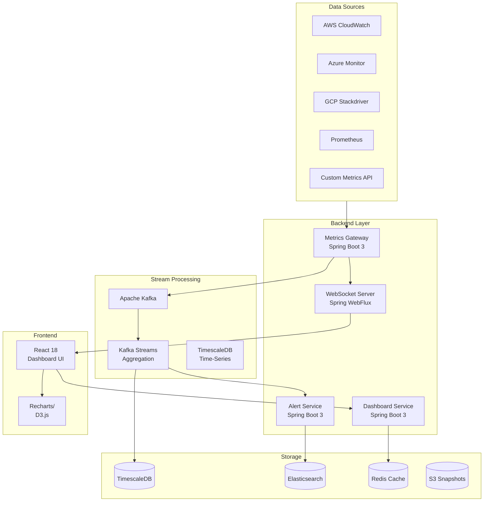

# 📊 Cloud Monitoring Dashboard

[](https://openjdk.org/)
[](https://spring.io/projects/spring-boot)
[](https://reactjs.org/)
[](https://aws.amazon.com/cloudwatch/)
[](https://www.typescriptlang.org/)
[](LICENSE)

> Production-ready cloud monitoring dashboard providing real-time infrastructure visibility, intelligent alerting, and actionable insights across AWS, Azure, and GCP environments.

## 🎯 Overview

The Cloud Monitoring Dashboard is a full-stack observability platform designed for modern DevOps teams. It aggregates metrics from multiple cloud providers and on-premise systems, presents them through intuitive dashboards, and automatically surfaces anomalies and performance bottlenecks.

### Key Capabilities
- **Multi-Cloud** — AWS CloudWatch, Azure Monitor, GCP Stackdriver integration
- **Real-Time Metrics** — Sub-second metric ingestion via WebSocket streams
- **Smart Alerting** — ML-based anomaly detection with configurable thresholds
- **Custom Dashboards** — Drag-and-drop dashboard builder with 40+ widget types
- **Incident Management** — Integrated on-call scheduling and escalation policies

## ✨ Features

### Monitoring & Observability
- ✅ 200+ AWS CloudWatch metrics pre-built
- ✅ Custom metric namespaces and dimensions
- ✅ Log aggregation and search (CloudWatch Logs Insights)
- ✅ Distributed tracing (AWS X-Ray integration)
- ✅ Infrastructure topology maps
- ✅ Service dependency graphs

### Alerting Engine
- 🔔 Multi-condition alert rules
- 📱 PagerDuty, Slack, OpsGenie integrations
- 🤖 ML anomaly detection (auto-baseline)
- 📈 Predictive alerting (ahead-of-threshold)
- 🔕 Alert correlation and deduplication

### Dashboard Builder
- 🎨 40+ visualization types (charts, gauges, heatmaps, logs)
- 📐 Responsive grid layout system
- 🔗 Deep-linking and shareable dashboards
- 📅 Time range controls with custom intervals
- 🔄 Auto-refresh with configurable intervals

## 🏗️ Architecture



## 🛠️ Tech Stack

| Category | Technology |
|----------|-----------|
| **Backend** | Java 17, Spring Boot 3.2, Spring WebFlux, Spring Security |
| **Frontend** | React 18, TypeScript, Redux Toolkit, Recharts, D3.js |
| **Database** | TimescaleDB (metrics), PostgreSQL (config), Redis (cache) |
| **Search** | Elasticsearch (logs & events) |
| **Streaming** | Apache Kafka, Kafka Streams |
| **Cloud** | AWS (CloudWatch, X-Ray, Lambda, ECS), Azure Monitor, GCP |
| **DevOps** | Docker, Kubernetes, GitHub Actions, Terraform |
| **Monitoring** | Prometheus, Grafana, Jaeger |

## 🚀 Getting Started

### Prerequisites
```
- Java 17+, Maven 3.9+
- Node.js 18+, npm 9+
- Docker Desktop
- AWS CLI with CloudWatch permissions
```

### Quick Start

```bash
# Clone
git clone https://github.com/goforitnick/cloud-monitoring-dashboard.git
cd cloud-monitoring-dashboard

# Configure AWS credentials
cp .env.example .env
# Edit .env with your AWS credentials and region

# Start with Docker Compose
docker-compose up -d

# Open dashboard
open http://localhost:3000
```

### AWS Setup

```bash
# Create IAM policy for CloudWatch read access
aws iam create-policy \
  --policy-name CloudMonitorDashboardPolicy \
  --policy-document file://infrastructure/iam/dashboard-policy.json

# Configure AWS credentials in .env
AWS_ACCESS_KEY_ID=your_key
AWS_SECRET_ACCESS_KEY=your_secret
AWS_REGION=us-east-1
```

## 📁 Project Structure

```
cloud-monitoring-dashboard/
├── backend/
│   ├── metrics-gateway/           # AWS CloudWatch metrics ingestion
│   │   ├── src/main/java/com/monitoring/
│   │   │   ├── aws/               # CloudWatch client & adapters
│   │   │   ├── kafka/             # Kafka producers
│   │   │   ├── websocket/         # Real-time WebSocket handlers
│   │   │   └── api/               # REST endpoints
│   │   └── pom.xml
│   ├── alert-service/             # Alert rules engine
│   ├── dashboard-service/         # Dashboard CRUD & config
│   └── notification-service/      # PagerDuty/Slack notifications
├── frontend/
│   ├── src/
│   │   ├── components/
│   │   │   ├── charts/            # Chart components (line, bar, gauge...)
│   │   │   ├── dashboard/         # Dashboard builder & grid
│   │   │   ├── alerts/            # Alert management UI
│   │   │   └── topology/          # Infrastructure topology view
│   │   ├── hooks/
│   │   │   ├── useMetrics.ts      # Real-time metrics WebSocket hook
│   │   │   └── useAlerts.ts       # Alert subscription hook
│   │   └── store/                 # Redux slices
├── infrastructure/
│   ├── terraform/                 # AWS infrastructure
│   ├── kubernetes/                # K8s manifests
│   └── iam/                       # IAM policies
├── .github/workflows/             # CI/CD pipelines
├── docker-compose.yml
└── README.md
```

## 📡 API Reference

### Metrics API

```bash
# Get metrics for a namespace
GET /api/v1/metrics?namespace=AWS/EC2&metric=CPUUtilization&period=300

# Get dashboard configuration
GET /api/v1/dashboards/{dashboardId}

# Create alert rule
POST /api/v1/alerts/rules
Content-Type: application/json
{
  "name": "High CPU Alert",
  "metric": "AWS/EC2:CPUUtilization",
  "threshold": 80,
  "operator": "GREATER_THAN",
  "period": 300,
  "evaluationPeriods": 2,
  "actions": ["arn:aws:sns:us-east-1:123:alerts"]
}
```

### WebSocket Subscriptions

```javascript
// Real-time metric subscription
const ws = new WebSocket('ws://localhost:8080/ws/metrics');
ws.send(JSON.stringify({
  action: 'SUBSCRIBE',
  namespace: 'AWS/EC2',
  metrics: ['CPUUtilization', 'NetworkIn', 'DiskWriteOps'],
  instanceId: 'i-1234567890abcdef0'
}));
```

## 📊 Sample Dashboards

The platform ships with pre-built dashboard templates:

| Dashboard | Description |
|-----------|-------------|
| **EC2 Overview** | CPU, memory, network, disk for all EC2 instances |
| **RDS Performance** | Query performance, connections, replication lag |
| **EKS Cluster** | Pod/node health, resource utilization |
| **Cost Analytics** | AWS cost breakdown by service and tag |
| **Application SLO** | Error rates, latency percentiles, availability |

## 🧪 Testing

```bash
# Backend tests
mvn test -pl backend/metrics-gateway
mvn verify -P integration-tests

# Frontend tests
cd frontend && npm test

# E2E tests
npx cypress run
```

## 🚢 Deployment

```bash
# Deploy to ECS with Terraform
cd infrastructure/terraform
terraform init
terraform plan -var="environment=production"
terraform apply

# Or deploy to Kubernetes
kubectl apply -f infrastructure/kubernetes/
```

## 🤝 Contributing

See [CONTRIBUTING.md](CONTRIBUTING.md) for guidelines.

## 📄 License

MIT License - see [LICENSE](LICENSE) for details.

---
<div align="center"><strong>⭐ Star this repo if you find it helpful!</strong></div>
